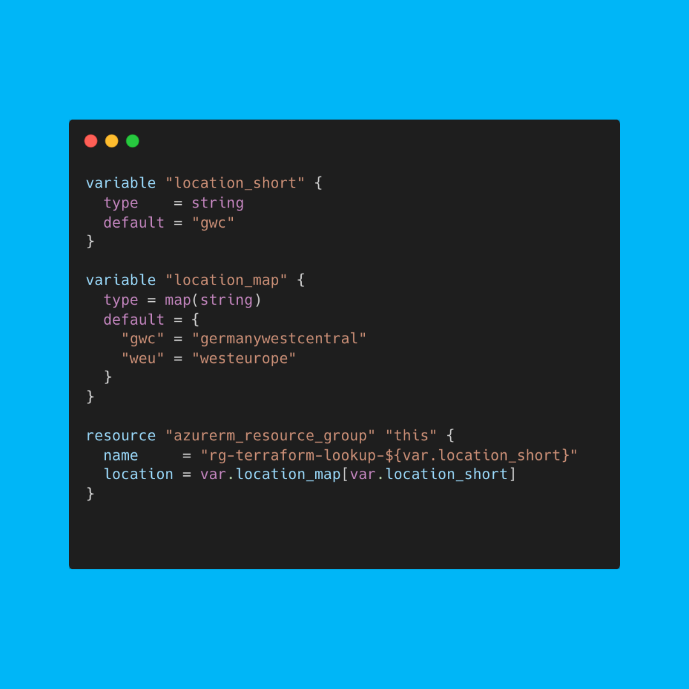

# Use map(string) as a lookup table of predefined values

In this example, the `location_short` (e.g. gwc) is passed as a parameter and then used as a key for the `location_map` to get a supported Azure location, which is then used to create a resource group.

